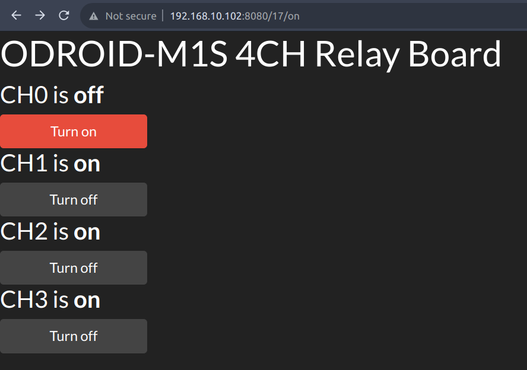

# Relay board example for ODROID-M1S

Two simple webserver examples are added:
  **RPi.GPIO version** - server_rpi_gpio.py
  **CircuitPython version** - server_circuit_python.py

## Download example code
> $ git clone https://github.com/tobetter/relayboard_odroidm1s.git
> 
> $ cd relayboard_odroidm1s

## For CircuitPython
>$ sudo apt install python3-dev python3-pip
>
>$ sudo python3 -m pip install --upgrade pip
>
>$ sudo python3 -m pip install Adafruit-Blinka gpiod
>
>$ sudo python3 server_circuit_python.py

## For RPi.GPIO
>$ sudo apt-get install git python3-dev
>
>$ git clone https://github.com/hardkernel/RPi.GPIO-Odroid
>
>$ cd RPi.GPIO-Odroid
>
>$ sudo python3 setup.py build install
>
>$ sudo python3 server_rpi_gpio.py
